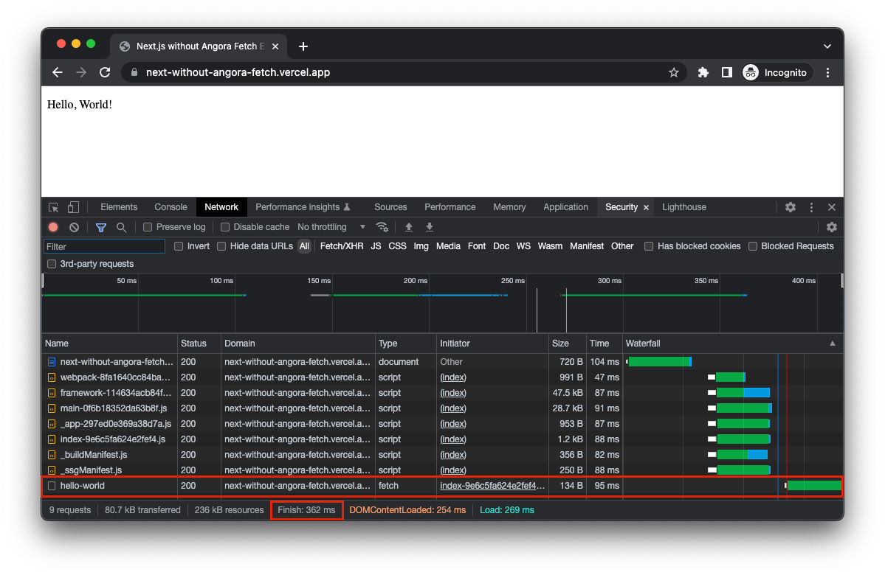
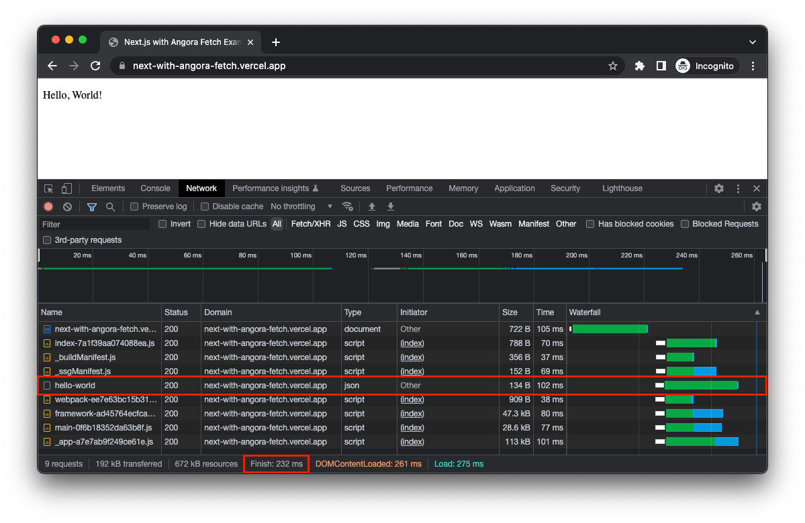

import { Callout } from 'nextra-theme-docs'

# Introduction

<Callout type="warning" emoji="⚠️">
  The package is not __*production ready*__, yet.
</Callout>
 
🔥 Angora Fetch will make your dynamic client-side data fetching __*Blazingly*__ 
fast.

📝 Takes advantage of 
[Resource Hints](https://www.w3.org/TR/resource-hints/#:~:text=%20These-,primitives%20enable%20the%20developer%2C%20and%20the%20server%20generating%20or%20delivering%20the%20resources%2C%20to%20assist%20the%20user%20agent%20in%20the%20decision%20process%20of%20which%20origins%20it%20should%20connect%20to%2C%20and%20which%20resources%20it%20should%20fetch%20and%20preprocess%20to%20improve%20page%20performance.,-2.%20Resource) 
without sacrificing the developer experience.

<Callout type="info" emoji="ℹ️">
  Currently only integrates with [Next.js](https://nextjs.org/).
  Once we have a stable API, we will support other frameworks too.
</Callout>

## Without Angora Fetch 🐌

https://next-without-angora-fetch.vercel.app

## With Angora Fetch 🔥

https://next-with-angora-fetch.vercel.app

